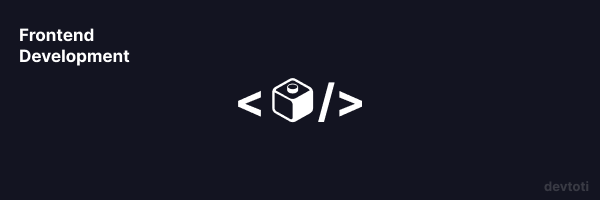

# Draftbit Frontend Exercise
3/3 Frontend Implementation
Medium fidelity prototype implementation using React, Typescript, and Tailwind CSS.

### How to run application locally

1. Clone repo to your local computer
2. Open folder with desired Code Editor
3. Run `npm install` in Terminal to install project dependencies
4. Run `npm run dev` in Terminal
5. Open localhost instance

## Characteristics
-This is mainly a static site
-The chosen prototype corresponds to the WIREFRAME TWO design.
-Light/dark modes enabled
-Flexbox & Grid Layouts

### Libraries

* @heroicons
* tailwind
* react-toggle-dark-mode

## Contact

toti.webdev@gmail.com
Antonio Ruiz
Frontend Developer & UI/UX Designer

Last update: January 19, 2024